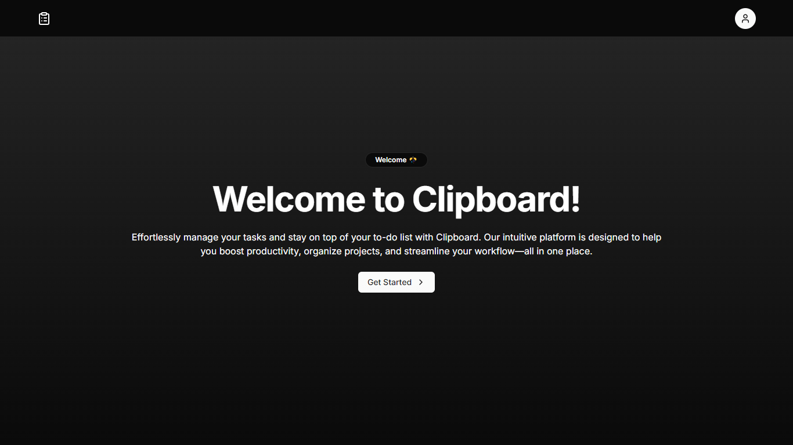
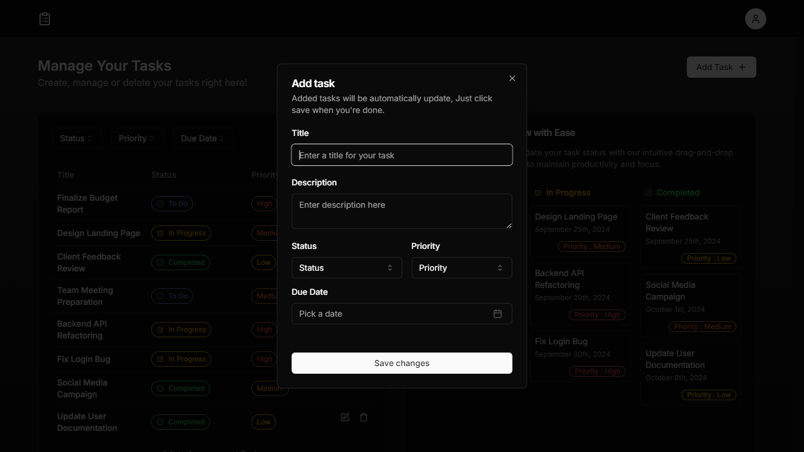
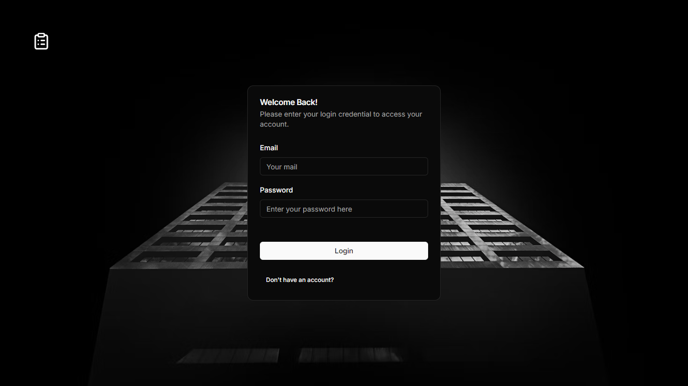

# My Next.js Project

This is a Next.js project bootstrapped with [`create-next-app`](https://github.com/vercel/next.js/tree/canary/packages/create-next-app).

## Project Overview

This project is a task management application that allows users to create, update, delete, and organize tasks efficiently. It features a Kanban board interface for easy status management and supports drag-and-drop functionality for seamless task organization.

### Features
- **Task Creation**: Users can create new tasks with a title, description, status, priority, and due date.
- **Task Management**: Easily edit or delete existing tasks.
- **Kanban Board**: Organize tasks visually using a Kanban board layout with three columns (To Do, In Progress, Completed).
- **Drag-and-Drop**: Change task status by dragging and dropping tasks between columns.
- **Filtering Options**: Filter tasks based on status, priority, and due date (ascending or descending).
- **Responsive Design**: Fully responsive layout for a seamless experience on various devices.

## Getting Started

To get started with the project, first, run the development server:

```bash
npm run dev
# or
yarn dev
# or
pnpm dev
# or
bun dev

Open [http://localhost:3000](http://localhost:3000) with your browser to see the result.

You can start editing the page by modifying `app/page.js`. The page auto-updates as you edit the file.

This project uses [`next/font`](https://nextjs.org/docs/basic-features/font-optimization) to automatically optimize and load Inter, a custom Google Font.

## Screenshots

  
*Welcome to Clipboard, Manage tasks with ease.*

  
*Manage your tasks efficiently with our intuitive interface, Easily organize tasks with our drag-and-drop Kanban board.*

  
*Add or Edit any tasks easily.*

  
*A secure and authenticated way to create, manage and update your tasks.*
